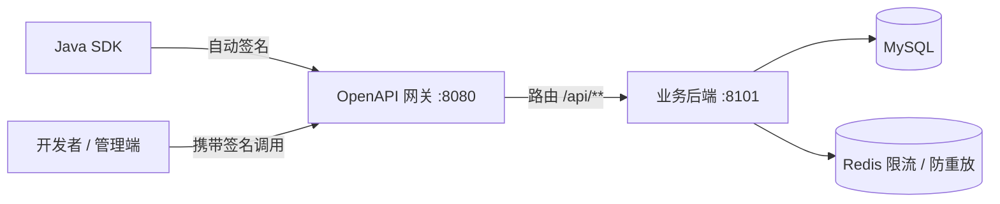

# OpenAPI 开放平台

基于 OpenAPI 规范的 API 开放平台项目：平台统一管理对外提供的接口，开发者通过签名鉴权机制安全地浏览、申请、调试与调用接口。

## 技术栈

| 分类 | 技术 |
| --- | --- |
| 语言 / 框架 | Java 17、Spring Boot 3.3、Spring Cloud Gateway |
| 前端 | Vue 3、Vite、Element Plus、Pinia |
| 数据存储 | MySQL 8、MyBatis-Plus、Redis 7 |
| 接口规范 | OpenAPI 3.0 / springdoc-openapi（Knife4j 兼容） |
| 部署运维 | Docker Compose、Maven |

## 架构



调用链路：开发者使用 SDK 或直接携带签名请求 → 网关统一入口（校验签名头、后续扩展限流）→ 后端拦截器完成签名校验、nonce 防重放 → 业务接口响应。

## 模块结构

```text
openapi-platform
├── openapi-common    # 公共模块：常量、签名工具、统一响应体、错误码
├── openapi-sdk       # 开发者调用 SDK：自动完成请求签名
├── openapi-backend   # 业务后端：用户/应用/接口管理 + 签名校验 + JWT 登录
├── openapi-gateway   # 网关：统一入口、签名头校验、限流扩展点
├── openapi-web       # 管理后台前端：Vue3 + Element Plus
├── db                # 数据库初始化脚本
└── docker-compose.yml # MySQL + Redis 一键启动
```

## 核心设计：签名鉴权

- 每个应用分配一对 `AccessKey / SecretKey`，AccessKey 公开标识身份，SecretKey 仅用于本地计算签名，不随请求传输
- 签名内容：`METHOD\n请求路径\n排序后的参数`（参数包含时间戳与 nonce），使用 `HMAC-SHA256 + SecretKey` 计算
- 服务端校验：签名头完整性 → 时间戳防过期（±5 分钟）→ nonce 防重放（Redis 记录，5 分钟内不可复用）→ 密钥查询 → 签名比对

## 功能规划

- 阶段一（MVP）：注册登录、应用管理（密钥生成）、接口发布与文档、签名鉴权、调用统计
- 阶段二（强化）：Redis + Lua 网关限流、消息队列异步统计、网关鉴权下沉
- 阶段三（可选）：Spring Cloud Alibaba（Nacos 服务发现 + Sentinel 熔断限流）、前端管理界面

## 快速开始

```bash
# 1. 启动 MySQL 与 Redis（首次会自动执行 db/init.sql）
docker compose up -d

# 2. 构建全部模块
mvn package -DskipTests

# 3. 启动业务后端（:8101）与网关（:8080）
java -jar openapi-backend/target/openapi-backend-0.0.1-SNAPSHOT.jar
java -jar openapi-gateway/target/openapi-gateway-0.0.1-SNAPSHOT.jar

# 4. 启动管理后台前端（开发模式）
cd openapi-web && npm install && npm run dev

# 5. 使用 SDK 调用已发布接口（见 openapi-sdk 的 DemoInvokeMain）
```

接口文档地址（后端直连，便于调试）：`http://localhost:8101/swagger-ui.html`
管理后台地址（开发模式）：`http://localhost:5173`

> 注意：`openapi-backend/src/main/resources/application.yml` 中的数据库与 Redis 连接参数需与本机环境一致。
