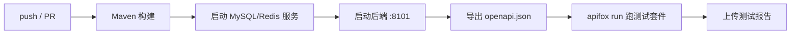

# CI 自动化测试（Apifox 接入 GitHub Actions）

> 目标：后端新增接口 → 自动导出 OpenAPI 文档 → Apifox 自动跑接口测试 → 报告归档，全流程无人值守。

## 全自动链路



工作流文件：`.github/workflows/ci.yml`（分支 `feature_dev` / `main` 触发）。

## Apifox 侧配置

1. 导入接口文档：接口管理 → 导入数据 → OpenAPI/Swagger → 从 URL 导入 `http://localhost:8101/v3/api-docs`（或文件 `docs/05-接口文档/openapi.json`）
2. 导入时勾选「自动生成成功用例」；从「接口」生成的用例**参数值为空**，需手动填写或改从「接口用例」导入
3. 运行环境（`47907739` 开发环境）Base URL = `http://localhost:8101`
4. 受签名保护的 `/api/**` 接口：在测试场景「前置操作」粘贴签名脚本（见 `docs/05-接口文档/Apifox签名前置脚本.js`）

## Apifox CLI 使用

```powershell
# 安装（Windows 全局目录无权限时用 --prefix 装到本地目录）
npm install -g apifox-cli
npm install -g apifox-cli --prefix E:\apifox-cli

# 必须先登录（不登录会报「没有权限访问指定的资源」）
E:\apifox-cli\apifox.cmd login --with-token <你的令牌>

# 查询有效 ID（测试集被重建后 ID 会变！）
apifox project list                    # 项目：OpenAPI = 8662244
apifox test-scenario list --project 8662244    # 场景：8584503
apifox environment list --project 8662244      # 开发环境：47907739

# 运行测试
apifox run --access-token <令牌> -t 8584503 -e 47907739 -n 1 -r cli,html --out-dir E:\apifox-reports
```

## GitHub Secrets 配置

仓库 Settings → Secrets and variables → Actions：

| Secret | 值 |
| --- | --- |
| `APIFOX_ACCESS_TOKEN` | Apifox 项目设置 → 高级设置 → API 访问令牌 |
| `APIFOX_TEST_SUITE_ID` | 场景用例 ID（当前 `8584503`） |
| `APIFOX_ENV_ID` | 环境 ID（开发环境 `47907739`） |

> ⚠️ secrets 未配置时，CI 中 Apifox 步骤会显示 `skipped`（绿色但没跑）；配置后才能看到 `success/failure`。

## 踩坑记录

### 1. 从「接口」导入的用例参数值为空
Apifox 官方行为：从接口生成的用例参数值需要手动填写。打开接口「运行」页示例值会自动填充，保存为用例即可；或手动在用例里填。

### 2. pm.request.url.query 是 PropertyList，不是普通对象
Apifox 的 query/form 是 Postman 的 PropertyList 结构，真实参数在 `.members` 数组里；直接遍历会拿到 `Type=function PostmanQueryParam(...)`、`reference=[object Object]`、`_postman_*` 内部字段，导致签名内容污染 → `40104 签名校验失败`。
解决：优先取 `.members`，跳过 `Type/members/reference/_postman*` 内部键。

### 3. 空值参数参与签名导致不一致
参数值为空时 Apifox 可能不发送该参数，但脚本若把空值算进签名 → 服务端重建不一致 → 40104。解决：脚本跳过空值参数。

### 4. CLI 必须先 login
`apifox run --access-token ...` 直接跑可能报「您没有权限访问指定的资源」，先执行 `apifox login --with-token <令牌>` 即可。

### 5. 测试场景被重建后 ID 变化
场景用例改名/重建后 ID 变化，GitHub secret 里旧 ID 失效 → 同样报无权限。用 `apifox test-scenario list` 查最新 ID 更新 secret。

### 6. 后端响应 createTime/updateTime/isDelete 为 null
MyBatis-Plus 插入后实体不自动回填时间字段，数据库有默认值但返回的 Java 对象是 null → Apifox schema 校验失败。解决：`MetaObjectHandler` 自动填充 + `isDelete` 显式赋值。

### 7. 注册接口重复账号
固定账号（如 admin）第二次运行报「账号已存在」。解决：参数值用 Apifox 动态值 `{{$timestamp}}`。

关联：[[架构设计]]、[[00-项目总览]]
