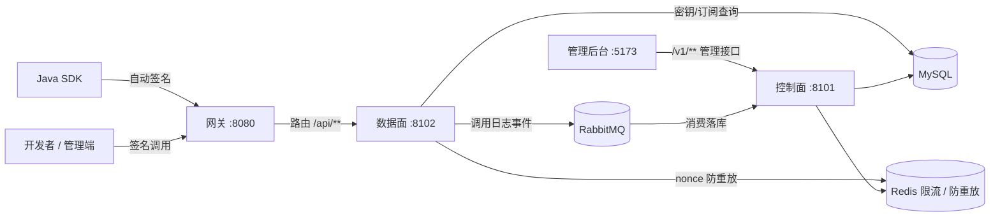

# 架构设计

## 架构图

## 控制面 / 数据面分离

| 平面 | 服务 | 职责 |
| --- | --- | --- |
| 控制面 | openapi-backend :8101 | 管理 API（/v1/**）：用户/应用/接口/订阅/统计/通知/限流管理，JWT + CSRF + 审计，MQ 消费落库 |
| 数据面 | openapi-api :8102 | 对外业务 API（/api/**）：AK/SK 签名鉴权 + nonce 防重放 + 订阅校验 + 调用日志生产 |

两平面共享 MySQL 元数据（app / interface / subscribe）、Redis、RabbitMQ，通过 `openapi-domain` 复用实体、Mapper、数据访问配置与 MQ 契约。

## 调用链路

1. 开发者用 SDK 或手工携带签名请求头调用网关 :8080
2. 网关（`SignatureGuardFilter`）校验签名头完整性、时间戳，并做 Redis + Lua 限流，路由 `/api/**` 到数据面 :8102
3. 数据面（`SignatureInterceptor`）完成密钥查询、nonce 防重放、签名比对、订阅校验
4. 校验通过后进入业务接口（本地实现或代理到上游），返回统一响应体；同时异步发布调用日志到 MQ
5. 控制面消费 MQ 消息，落库 invoke_log 并聚合统计

## 模块职责

| 模块 | 职责 |
| --- | --- |
| openapi-common | 签名工具、签名头校验器、统一响应体、错误码、常量 |
| openapi-domain | 共享领域层：实体、Mapper、数据访问配置、MQ 契约 |
| openapi-sdk | 开发者调用 SDK，自动签名 |
| openapi-backend | 控制面：管理 API + JWT 登录 + MQ 消费 + 统计 |
| openapi-api | 数据面：对外 API + 签名鉴权 + 调用日志生产 |
| openapi-gateway | 统一入口、签名头校验、限流 |
| openapi-web | 管理后台前端 |

## 为什么网关只做部分校验

网关负责入口校验（签名头完整性、时间戳）与限流，完整签名校验放数据面（数据面可访问密钥库）。后续可把鉴权/限流下沉到网关，形成双重保障。详见 [[签名鉴权原理]]。
