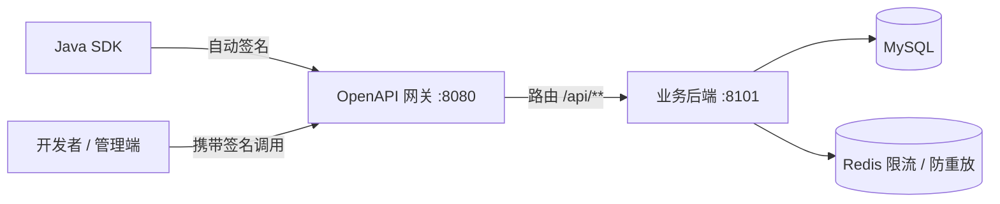

# 架构设计

## 架构图

## 调用链路

1. 开发者使用 SDK 或手工携带签名请求头调用网关
2. 网关（`SignatureGuardFilter`）校验签名头完整性与时间戳，转发 `/api/**` 到后端
3. 后端拦截器（`SignatureInterceptor`）完成密钥查询、nonce 防重放、签名比对
4. 校验通过后进入业务接口，返回统一响应体

## 模块职责

| 模块 | 职责 |
| --- | --- |
| openapi-common | 签名工具、统一响应体、错误码、常量 |
| openapi-sdk | 开发者调用 SDK，自动签名 |
| openapi-backend | 用户/应用/接口管理、签名校验拦截器 |
| openapi-gateway | 统一入口、签名头校验、限流扩展点 |

## 为什么网关只做部分校验

骨架阶段网关负责入口与时间戳校验，签名校验放后端（后端可访问密钥库）。后续可将鉴权/限流下沉到网关，形成双重保障。详见 [[签名鉴权原理]]。
