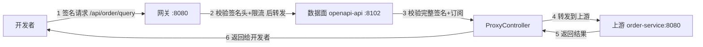
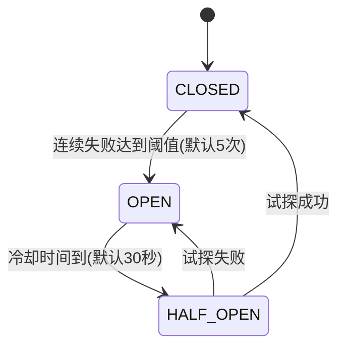

# 上游服务配置 / 超时 / 重试 / 熔断（入门讲解）

> 面向第一次接触 API 网关/开放平台「上游代理」概念的同学，用生活类比 + 一个贯穿全篇的例子讲清楚整条链路。关联代码：`openapi-api` 模块的 `UpstreamProxyService` / `CircuitBreaker` / `ProxyController`。

---

## 一、先搞懂「上游服务（upstream）」是什么

想象你在一个「代办窗口」办事：

- **你** = 开发者（调用 API 的人）
- **代办窗口** = 开放平台（本项目的「数据面 openapi-api」）
- **后台办公室** = 上游服务（upstream，一个真正干活的 HTTP 服务，比如 `http://order-service:8080`）

关键点：**代办窗口自己不一定办事，它常常是「中转」——把你的请求转交给后台办公室，再把结果带回来给你。**

对应到本项目：

| 生活角色 | 项目角色 |
| --- | --- |
| 代办窗口 | 数据面 `openapi-api`（收到 `/api/**` 请求） |
| 后台办公室 | 上游服务 `upstream`（接口配置里填的地址） |
| 接口配置 | `interface_info` 表里的 `upstream` 字段 |

之前的 demo 接口（`/api/demo/name`）是「窗口自己直接办」（业务代码写死在 `DemoController` 里），**没有上游**。这次新增的能力是：让接口可以「转交给上游去办」。

---

## 二、一条完整链路（以「查询订单」为例）

假设管理员在平台配了一个接口：

- 接口名：查询订单
- 对外路径：`GET /api/order/query`
- 上游地址：`http://order-service:8080`
- 超时：`timeout_ms = 3000`（3 秒）
- 重试：`retry_count = 1`（失败再试 1 次）

现在开发者用 SDK 发起一次调用，整条链路是：



分步解释：

1. **开发者**用 SDK 自动给请求加上签名头（`X-Access-Key` / `X-Timestamp` / `X-Nonce` / `X-Signature`），发给网关。
2. **网关**只做「粗校验」：签名头全不全、时间戳过没过期、限不限流。通过后把请求路由到数据面。
3. **数据面**做「细校验」：密钥对不对、nonce 有没有重放、签名比对、有没有订阅这个接口。全过了才放行。
4. **ProxyController**（兜底路由）发现这个接口配了 `upstream`，于是**把请求转发给 `order-service:8080`**——这就是「上游代理」。
5. 上游真正干活（查数据库、算业务逻辑），返回结果。
6. 数据面把结果原样带回给开发者。

> 注意：如果接口**没配** `upstream`（像 demo 接口那样），就不会走代理，而是走本地写好的业务代码；配了 `upstream` 的接口才会被转发。

---

## 三、三个「保护机制」逐个讲

上游服务是「别人家的服务」，它可能会**慢、会挂、会抖动**。如果窗口傻等或反复乱打，会把问题放大。于是有了三道保险：

### 3.1 超时（timeout）

**生活类比**：你去窗口办事，工作人员说「我最多等 3 秒，后台不回复我就先告诉您稍后再来」。

**作用**：给「等待上游」设一个上限，**防止无限等待**。如果不设超时，一个慢上游会把窗口的线程都占住，后面所有请求都卡死（雪崩）。

**字段**：`timeout_ms`（毫秒），默认 3000。

**通俗理解**：超过 3 秒没响应，就当它「这次失败了」。

---

### 3.2 重试（retry）

**生活类比**：打电话没打通，挂掉**再拨一次**——因为可能是信号临时抖动，不是对方真的不接。

**作用**：网络偶尔抖动（超时、连接被重置）时，多试几次，提高成功率。

**字段**：`retry_count`（次数），默认 0（不重试）。

**关键原则（容易踩坑）**：

- ✅ **该重试的**：网络错误、上游 5xx（服务器内部错误）——「暂时性故障」，再试可能就好了。
- ❌ **不该重试的**：4xx（客户端错误，比如 400 参数错、404 不存在）——「你请求本身就是错的」，再试一百次也没用，只会浪费。

本项目的实现：`UpstreamProxyService` 里 4xx 直接透传返回、不重试；5xx 和网络错误才重试。

---

### 3.3 熔断（circuit breaker）

**生活类比**：家里的**保险丝 / 空气开关**。短路时它会「啪」地跳闸，切断电路，保护后面的电器不被烧坏。等故障排除，再手动合闸。

**作用**：当上游**连续失败很多次**时，就不再傻乎乎地每个请求都转发过去（浪费资源、放大故障），而是**快速失败**，给上游喘息恢复的时间。

**核心状态机**（三个状态来回跳）：



| 状态 | 含义 | 类比 |
| --- | --- | --- |
| **CLOSED（关闭）** | 正常工作，请求照常转发 | 电路正常通电 |
| **OPEN（打开/熔断）** | 拒绝转发，直接返回「稍后再试」 | 跳闸了，灯灭了 |
| **HALF_OPEN（半开）** | 冷却后放行**一个**请求试探 | 试探性合闸，看还会不会跳 |

**为什么要「半开」而不是直接恢复？** 因为不敢确定上游修好了。先放一个请求试试：成功了才完全恢复（CLOSED）；又失败就继续熔断（OPEN）。

**本项目实现**：`CircuitBreaker` 类，默认「连续失败 5 次 → 熔断 30 秒 → 半开试探」。按 `upstream` 地址隔离（A 服务挂了不影响 B 服务）。

---

## 四、三者配合起来的一个「故事」

开发者调用「查询订单」接口，上游 `order-service` 恰好挂了，时间线如下：

| 时刻 | 发生了什么 | 机制 |
| --- | --- | --- |
| T=0 | 第 1 次请求转发到上游 | - |
| T=3s | 上游 3 秒没响应 | **超时**触发 |
| T=3s | 自动再试第 1 次（retry_count=1） | **重试** |
| T=6s | 又超时，重试也失败 | - |
| T=6s | 记录 1 次失败 | 熔断计数 +1 |
| ...（同样的事再发生 4 次）| 累计 5 次失败 | 熔断计数 = 5 |
| T=30s | 达到阈值，**熔断打开** | **熔断** |
| T=31s~60s | 新的请求**不再转发**，直接返回「上游熔断中，请稍后重试」 | 快速失败 |
| T=60s | 冷却 30 秒到了，放行 1 个请求试探 | **半开** |
| T=60s | 试探请求：如果上游恢复了 → 成功 → 完全恢复；否则继续熔断 | 恢复 / 再熔断 |

**这样做的意义**：上游挂了的 30 秒里，开发者能立刻得到「稍后再试」的明确反馈（而不是卡 3 秒超时），上游也不会被雪崩式请求压垮，恢复更快。

---

## 五、对应到本项目代码

| 概念 | 字段 / 类 | 位置 |
| --- | --- | --- |
| 上游地址 | `interface_info.upstream` | `openapi-domain` 实体 |
| 超时 | `interface_info.timeout_ms` | 同上 |
| 重试次数 | `interface_info.retry_count` | 同上 |
| 转发 + 超时 + 重试 | `UpstreamProxyService` | `openapi-api/proxy/` |
| 熔断状态机 | `CircuitBreaker` | `openapi-api/proxy/` |
| 兜底路由（决定要不要代理） | `ProxyController` | `openapi-api/controller/` |

管理端在「接口管理 → 新增/编辑接口」时填写 `upstream / timeout_ms / retry_count` 三个字段即可（目前后端已支持，前端表单待补）。

---

## 六、常见误区 / 面试点

1. **「超时」和「重试」要搭配**：只超时不重试，抖动就失败；只重试不超时，可能无限等。
2. **重试要幂等**：被重试的接口最好「重复调用结果一样」（比如查询），否则重复下单就麻烦了——这是更深的话题（幂等性）。
3. **熔断≠限流**：限流是「主动控制进来的流量」，熔断是「上游坏了被动切断」，两者常配合使用。
4. **熔断状态要能共享**：本项目 `CircuitBreaker` 是进程内的，多实例部署时每个实例各记各的账；生产级常用 Redis 或 Resilience4j 做分布式熔断。

---

## 七、实操演示：order-demo-service

项目里加了一个 `order-demo-service`（**:8103**），模拟真实上游「订单服务」，把上面的概念跑起来。

### 服务与演示接口

| 接口 | 说明 |
| --- | --- |
| `GET /api/order/query` | 返回模拟订单；`?delay=毫秒` 模拟上游慢（触发超时）、`?fail=true` 模拟 500（触发重试/熔断） |
| `GET /api/order/list` | 订单列表 |
| `POST /api/order/create` | 创建订单 |

平台已预置接口「订单查询（上游演示）」（`/api/order/query`，`upstream=http://localhost:8103`、超时 3000ms、重试 1 次），演示应用（`AK=demo-access-key` / `SK=demo-secret-key`）已订阅并通过审批。

### 两种调用方式对比

```bash
# 1) 直连上游（绕过平台，无鉴权）
curl "http://127.0.0.1:8103/api/order/query?id=1"

# 2) 经平台完整链路（签名调用，走网关 8080）
# 网关 → 数据面签名校验 → 订阅校验 → 代理转发到 order-demo:8103
# 签名建议用 openapi-sdk 的 DemoInvokeMain，或 Apifox 前置脚本，手动拼 HMAC 容易错
```

### 怎么触发三个机制

| 想演示 | 怎么触发 | 预期 |
| --- | --- | --- |
| 超时 | `?delay=6000`（上游睡 6 秒 > 超时 3 秒） | 3 秒超时 → 重试 → 502 |
| 重试 | `?fail=true`（上游返回 500） | 重试 1 次仍 500 → 502 |
| 熔断 | 连续多次 `?fail=true` | 连续 5 次失败后熔断打开，后续请求秒级返回「上游熔断中」 |
| 恢复 | 去掉 `fail` 正常调用 | 半开试探成功后恢复 |

---

## 关联笔记

[[架构设计]] · [[签名鉴权原理]] · [[OpenAPI 平台改造清单]]
